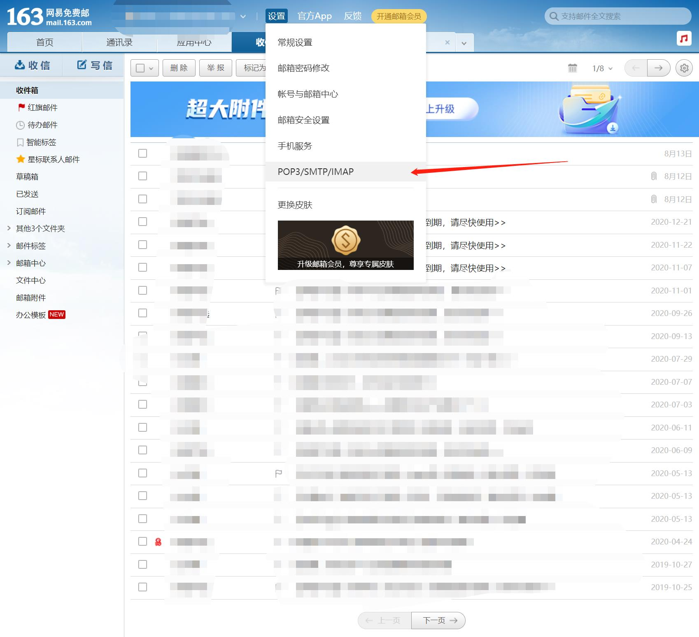

# 发送邮件

```
pip install smtplib
pip install xlrd==1.2.0 # 高版本不支持 xlsx 后缀文件
pip install pyinstaller # 生成可执行文件，根据使用的系统生成不同格式；windows：.exe
```

## 使用方式

在`元数据`文件`./.meta.conf`加入用户信息

`assets`文件夹中
- `title.txt` 写入要发送的标题
- `main.txt` 写入要发送的主题内容
- `receivers` 写入收件人与对应的文件名
- `files` 放入对应文件名的文件

## 元数据信息

`./.meta.conf`，存储用户配置信息，未上传，格式如下
```
host:example.com
username:foo
password:bar
```

## 邮件配置

获取电子邮箱的 IMAP\SMTP（收发信）的功能

以 163 邮箱为例



元信息数据中的密码有时可能为`授权码`

### 企业邮箱

登录邮箱 >> 设置 >> 微信绑定 >> 新增授权密码 >> 生成授权密码